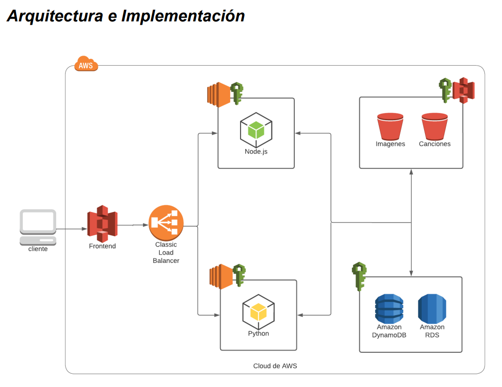
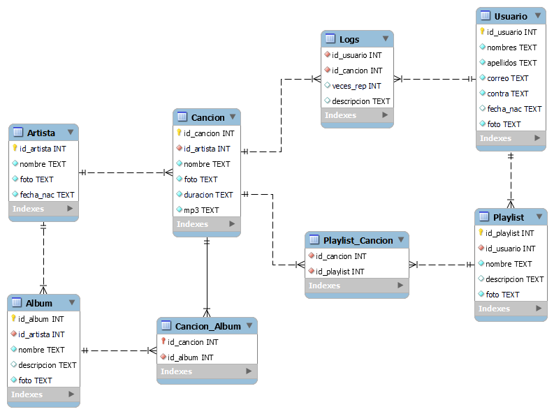
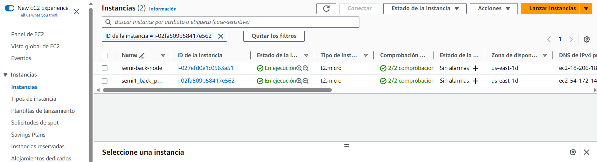
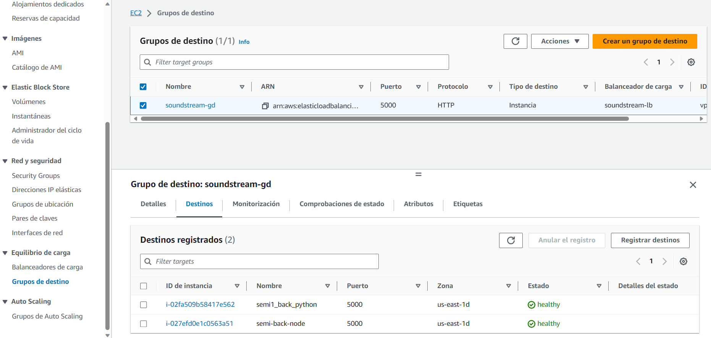

### Universidad de San Carlos de Guatemala, 06 Octubre 2023
### Facultad de Ingeniería
### Escuela de Ciencias y Sistemas
### Seminario de Sistemas 1

---
# Seminario 1 | Grupo #7 | Proyecto 1
---

> Integrantes
> - Deivid Alexander Lux Revolorio - 201549059
> - Fernando José Jr. Serrano Mejia  -   201701039
> - Herberth Abisai Avila Ruiz   -    201504464

---
# MANUAL DE CONFIGURACIÓN
---
## CONTENIDO
* [Descripción](#descripción)
* [Objetivos](#objetivos)
    * [General](#general)
    * [Específicos](#específicos) 
* [Arquitectura de la Aplicación Web con React, Load Balancer, EC2, S3 y MySQL](#explicacion-arquitectura)
* [MODELO ENTIDAD RELACION](#modelo-entidad-relacion)
* [CONFIGURACION DE ARRANQUE PARA LOS SERVIDORES](#configuracion-arranque)
* [USUARIO IAM](#usuario-iam)
  * [Asociar Políticas](#asociar-políticas)
* [Configuración de Servicio EC2 (Ubuntu 22.04, t2.micro)](#configuracion-ec2)
* [Configuración de Servicio S3](#configuracion-s3)
* [Configuración de Servicio Load Balancer](#configuracion-load-balancer)
* [CONCLUSIONES](#conclusiones)
<!-- toc! -->

---

## Descripción
Amazon Web Services (AWS) es una plataforma de servicios de nube que ofrece potencia de cómputo, almacenamiento de bases de datos, entrega de contenido y otra funcionalidad para ayudar a las empresas a escalar y crecer. Se desarrollará una aplicación web inspirada en los servicios de multimedia, en donde se tendrán dos diferentes tipos de usuarios, usuario administrador que podrá subir canciones y agregarlas a álbumes, y un usuario suscriptor que puede reproducir canciones, crear playlist y agregar canciones, realizar búsquedas, y estadísticas de su cuenta.
Los servicios de AWS que se utilizaran para este proyecto son:
* IAM
* EC2
* Load Balancer
* S3
* RDS

---

## Objetivos
### General
* Implementar los servicios de seguridad y desarrollo de AWS
### Específicos
* Crear un entorno de desarrollo para una aplicación web
* Implementar una arquitectura personalizada
* Integrar servicios y APIs de AWS

## Requerimientos del Sistema
Para realizar éste proyecto se deberá cumplir con los siguientes requerimientos:

#### Marco de trabajo
`El proyecto se desarrollo con el editor de texto Visual Studio Code en su version: 1.83.0, los lenguajes a utilizar fueron Python en su version: 3.11.5, Pip version: 23.2.1, Nodejs version: 18.18.0, npm version: 9.8.1. El framework utilizado fue React.`
#### Servicios en AWS
` Se utilizaron 2 instancias EC2 en AWS para el despliegue de los 2 servidores (Python y Nodejs). Un servicio S3 para el almacenamiento de imagenes, mp3 y el lanzamiento estatico de la aplicacion de React. Un servicio Load Balancer.`

#### Sistema operativo
`Sistema operativo Windows 11. (Local). Sistema operativo Ubuntu 22.04 (Instancia EC2)`

---

## Arquitectura de la Aplicación Web con React, Load Balancer, EC2, S3 y MySQL

### Cliente

* El cliente interactúa con el frontend de la aplicación web, que está construido con React y se despliega como un sitio estático en Amazon S3.
* La interfaz de usuario proporciona una experiencia interactiva y amigable para los usuarios finales.

### Frontend (React) - Alojado en Amazon S3

* El frontend estático construido con React se almacena en Amazon S3, un servicio de almacenamiento en la nube altamente escalable de AWS.
* Los archivos HTML, CSS, JavaScript y otros recursos estáticos son servidos directamente desde S3 a los navegadores de los usuarios.

### Load Balancer (Amazon Elastic Load Balancing)

* Se utiliza un balanceador de carga de aplicación de Amazon Elastic Load Balancing (ALB) para distribuir el tráfico entre los servidores EC2.
* El ALB gestiona las solicitudes entrantes y las dirige a las instancias EC2 disponibles para equilibrar la carga y garantizar una alta disponibilidad.

### Servidores EC2

* Dos servidores EC2 independientes, uno ejecutando una aplicación en Python y otro ejecutando una aplicación en Node.js.
* Comunicación Frontend - EC2: El frontend en S3 se comunica con estas instancias EC2 a través del ALB. Las solicitudes del frontend son enviadas al ALB, que luego las dirige a las instancias EC2.
* Comunicación EC2 - S3: Las instancias EC2 se comunican con el servicio S3 a través de la API REST para almacenar y recuperar imágenes y archivos de audio (mp3) necesarios para la aplicación.
* Comunicación EC2 - MySQL: Las instancias EC2 se conectan a la base de datos MySQL en la nube para realizar operaciones de lectura y escritura relacionadas con los usuarios, canciones, álbumes, listas de reproducción, etc.

### Base de Datos (MySQL)

* Se utiliza una base de datos MySQL en la nube para almacenar datos estructurados como información de usuarios, detalles de canciones, álbumes, listas de reproducción, etc.
* Las instancias EC2 interactúan con la base de datos para realizar operaciones de CRUD (Crear, Leer, Actualizar y Eliminar) según las solicitudes de la aplicación.

### Flujo de Datos

* El cliente interactúa con la aplicación a través del frontend alojado en S3.
* El frontend envía solicitudes al ALB.
* El ALB distribuye las solicitudes entre las instancias EC2 (Python y Node.js) disponibles.
* Las instancias EC2 se comunican con el servicio S3 para manejar imágenes y archivos de audio, y también acceden a la base de datos MySQL para realizar operaciones de base de datos.

Esta arquitectura proporciona escalabilidad, alta disponibilidad y un rendimiento eficiente, permitiendo que la aplicación web maneje un gran número de usuarios y grandes volúmenes de datos. Además, la separación de componentes y servicios permite una fácil escalabilidad individual de cada capa según las necesidades de la aplicación.

## MODELO ENTIDAD RELACION
Modelo entidad relacion propuesto para almacenar los datos. 

### CONFIGURACION DE ARRANQUE PARA LOS SERVIDORES
#### Servidor Python
Para el servidor en Python se crea un entorno virtual para almacenar todas las dependencias que este requiere para funcionar. La manera para levantar el servidor es el siguiente:

    ´´´bash
    ubuntu@ip:~/Semi1-Grupo7-Proyecto1/backend_python$ source myenv/bin/activate

    (myenv) ubuntu@ip:~/Semi1-Grupo7-Proyecto1/backend_python/src$ python app.py

#### Servidor Nodejs
Para el servidor en Nodejs se levanta desde la carpeta dist, de la siguiente manera:

    ´´´bash
    ubuntu@ip:~/Semi1-Grupo7-Proyecto1/backend_node$ node ./dist/index.js

### USUARIO IAM
Primero, inicia sesión en tu consola de AWS y sigue estos pasos para crear un nuevo usuario de IAM:

* Ve a la consola de IAM en AWS.
* Haz clic en "Usuarios" y luego en "Agregar usuario".
* Ingresa el nombre del usuario (por ejemplo, "MiUsuarioApp") y selecciona el tipo de acceso: "Acceso programático" para permitir el acceso a través de la API.
* Haz clic en "Siguiente: Permisos".

#### Asociar Políticas
Asocia las siguientes políticas al usuario de IAM para que pueda interactuar con los recursos necesarios en AWS:

#### Para el servidor Python en EC2
* Política para EC2 (para el servidor Python):
Descripción: Permite el inicio, detención y descripción de instancias EC2.
JSON de política:

    ´´´json
    {
        "Version": "2012-10-17",
        "Statement": [
            {
                "Effect": "Allow",
                "Action": [
                    "ec2:StartInstances",
                    "ec2:StopInstances",
                    "ec2:DescribeInstances"
                ],
                "Resource": "*"
            }
        ]
    }

* Política para EC2 (para el servidor Node.js):
Descripción: Permite el inicio, detención y descripción de instancias EC2.
JSON de política:

    ´´´json
    {
        "Version": "2012-10-17",
        "Statement": [
            {
                "Effect": "Allow",
                "Action": [
                    "ec2:StartInstances",
                    "ec2:StopInstances",
                    "ec2:DescribeInstances"
                ],
                "Resource": "*"
            }
        ]
    }

#### Para el Frontend en React
* Política para S3 (para el almacenamiento del frontend):
Descripción: Permite la gestión de objetos en el bucket de S3 utilizado para almacenar los archivos del frontend.
JSON de política:

    ´´´json
    {
        "Version": "2012-10-17",
        "Statement": [
            {
                "Effect": "Allow",
                "Action": [
                    "s3:GetObject",
                    "s3:PutObject",
                    "s3:DeleteObject"
                ],
                "Resource": "arn:aws:s3:::nombre-de-tu-bucket/*"
            }
        ]
    }

#### Revisar y Crear
* Haz clic en "Revisar políticas" para verificar que las políticas estén configuradas correctamente.
* Haz clic en "Crear usuario".

Después de crear el usuario de IAM y asignarle las políticas adecuadas, recibirás las credenciales de acceso (ID de acceso y clave secreta). Asegúrate de almacenar estas credenciales de forma segura y nunca compartirlas públicamente.

---

### Configuración de Servicio EC2 (Ubuntu 22.04, t2.micro)
#### Crear una nueva instancia EC2

* Inicia sesión en la consola de AWS.
* Ve a la sección EC2 y haz clic en "Launch Instance".
* Selecciona "Ubuntu Server 22.04 LTS (HVM), SSD Volume Type" como tu imagen de instancia.
* Elije el tipo de instancia "t2.micro".
* Configura las opciones adicionales según tus necesidades (red, almacenamiento, seguridad, etc.).
* Haz clic en "Launch" para crear la instancia.
* Asocia una clave SSH para acceder a la instancia.
* Conéctate a la instancia:

#### Abre una terminal en tu máquina local
Utiliza el comando:

    ´´´bash
    ssh -i ruta/a/tu/clave-ssh.pem ubuntu@<ip-de-tu-instancia>
    
Para conectarte a tu instancia EC2.

### Configuración de Servicio S3
#### Crear un Bucket de S3 para el Frontend

* Ve a la consola de AWS y selecciona el servicio S3.
* Haz clic en "Create Bucket".
* Ingresa un nombre único para tu bucket.
* Selecciona la región en la que deseas crear el bucket.
* Haz clic en "Create" para crear el bucket.

#### Configurar políticas de Bucket (si es necesario)

* Ve a la sección de permisos del bucket.
* Configura las políticas de acceso según tus requisitos. Por ejemplo, puedes permitir el acceso público a los archivos en el bucket o restringir el acceso a ciertas IP.

#### Subir Archivos al Bucket

* Haz clic en tu bucket.
* Haz clic en "Upload" para subir los archivos del frontend (por ejemplo, los archivos de React build) al bucket.

### Configuración de Servicio Load Balancer
#### Crear un Application Load Balancer

* Ve a la consola de AWS y selecciona el servicio EC2.
* En el panel de navegación izquierdo, haz clic en "Load Balancers" y luego en "Create Load Balancer".
* Selecciona "Application Load Balancer".
* Configura el balanceador de carga según tus necesidades, incluyendo las instancias EC2 que deseas asociar.
* Configura los listeners y las reglas de enrutamiento según las rutas de tu aplicación.

#### Configurar Grupos de Destino

* Configura los grupos de destino para el Load Balancer, asociando las instancias EC2 que deseas balancear.
* Puedes configurar health checks para asegurarte de que las instancias estén funcionando correctamente.

#### Asociar el Load Balancer con el Bucket de S3 (Opcional)

* Si necesitas que el Load Balancer sirva contenido estático desde S3, puedes configurar una regla en el Load Balancer para redirigir ciertas rutas al bucket de S3.

---

### CONCLUSIONES
Implementar una arquitectura en la nube utilizando servicios como Amazon EC2 para servidores Python y Node.js junto con Amazon S3 para alojar el frontend estático ofrece una serie de ventajas clave:

#### Escalabilidad y Flexibilidad

* EC2: Permite escalar vertical y horizontalmente según la demanda de tráfico y recursos.
* S3: Proporciona escalabilidad ilimitada para el almacenamiento estático, sin preocupaciones por el espacio o la administración del servidor.

#### Seguridad y Control

* IAM: Ofrece un control granular sobre quién puede acceder y modificar los recursos, mejorando la seguridad.
* EC2 Security Groups y NACLs: Permiten configurar reglas de firewall a nivel de instancia y de red para proteger los servidores.
* S3 Bucket Policies y ACLs: Permiten definir políticas de acceso y controlar los permisos de los archivos estáticos.

#### Alto Rendimiento

* EC2: Permite utilizar instancias optimizadas para cargas de trabajo específicas, asegurando un rendimiento óptimo para las aplicaciones Python y Node.js.
* S3: Al estar diseñado para manejar grandes volúmenes de tráfico, garantiza la entrega rápida y confiable del contenido estático.

#### Facilidad de Implementación y Gestión

* EC2: Facilita la implementación de aplicaciones Python y Node.js utilizando imágenes preconfiguradas y opciones de automatización como User Data y AWS Systems Manager.
* S3: Simplifica la gestión de archivos estáticos, eliminando la necesidad de administrar servidores web para entregar el frontend.

#### Economía y Precio Justo

* EC2: Ofrece opciones de precios flexibles, como instancias reservadas y spot instances, que pueden ayudar a optimizar los costos.
* S3: Su modelo de precios es asequible y escalable, pagando solo por el almacenamiento y transferencia de datos que realmente se utilizan.

#### Despliegue Continuo y Actualizaciones Sencillas

* S3: Facilita el despliegue continuo del frontend, permitiendo actualizaciones sencillas mediante la carga de nuevos archivos o versiones.

##### Integración y Compatibilidad

* APIs de AWS: Permiten la integración con una amplia gama de servicios adicionales para funciones como monitoreo, análisis y gestión de tráfico, entre otros.
