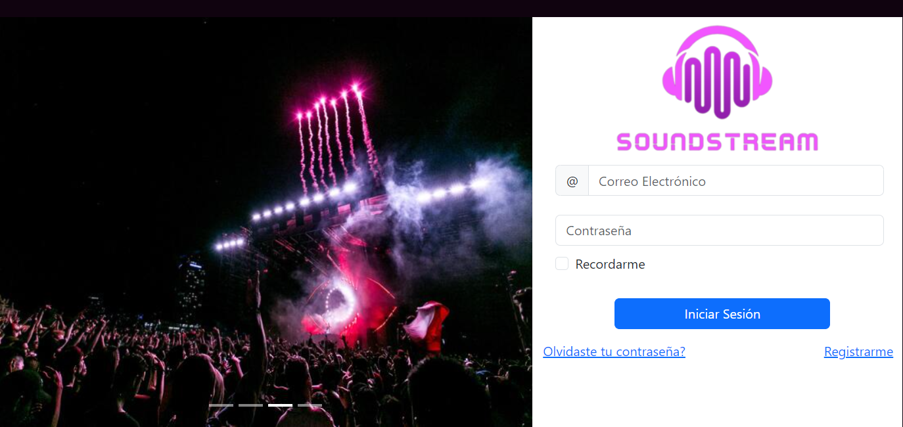
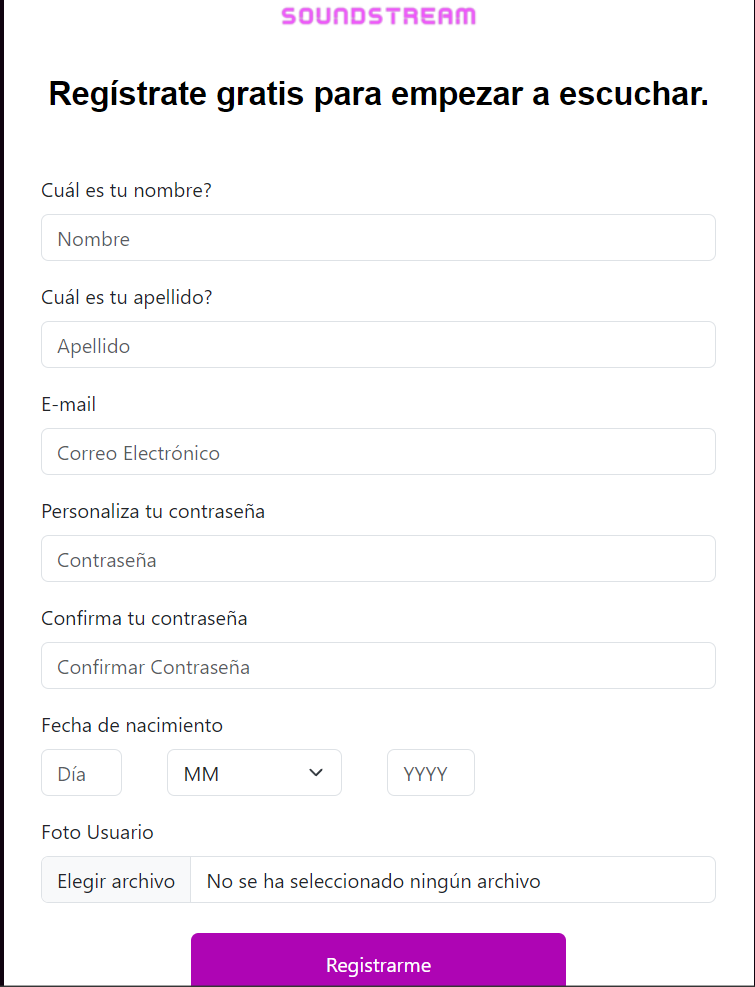
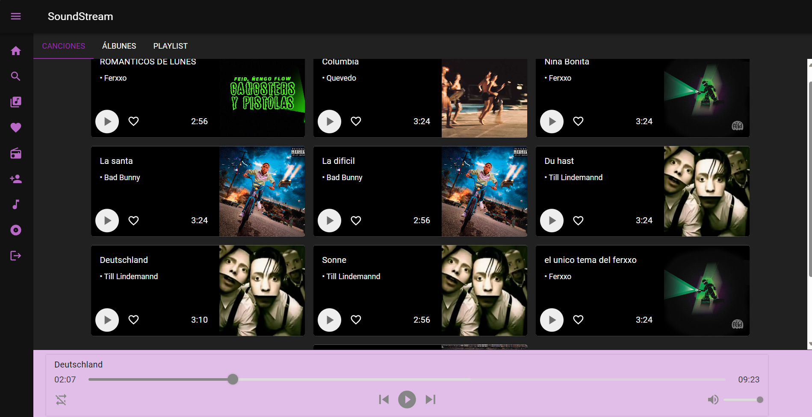
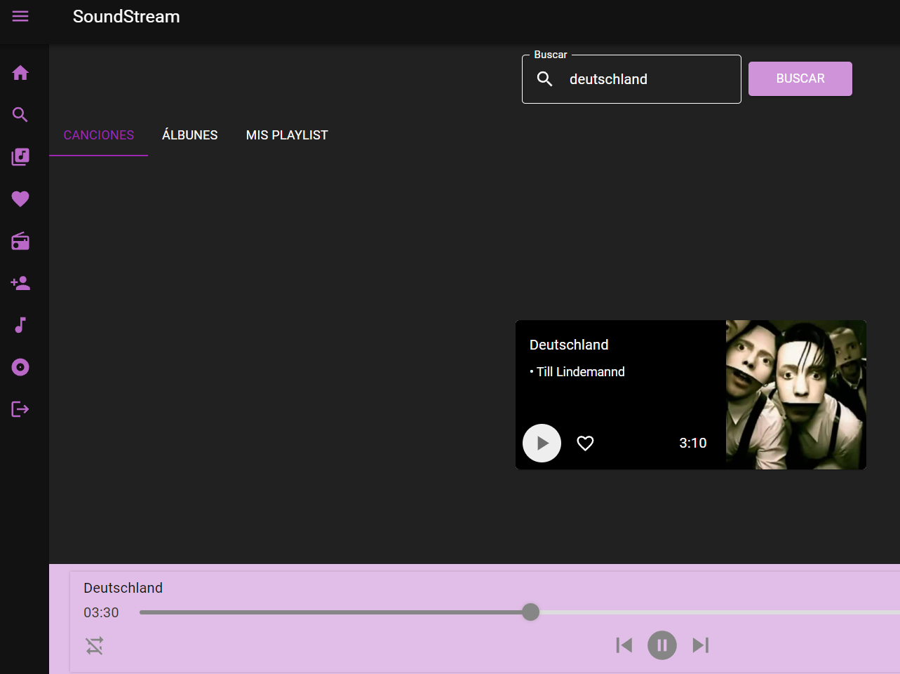
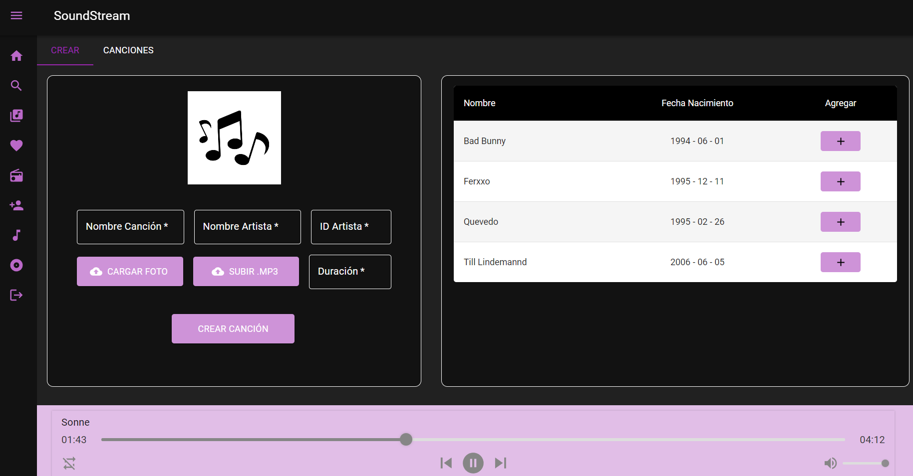
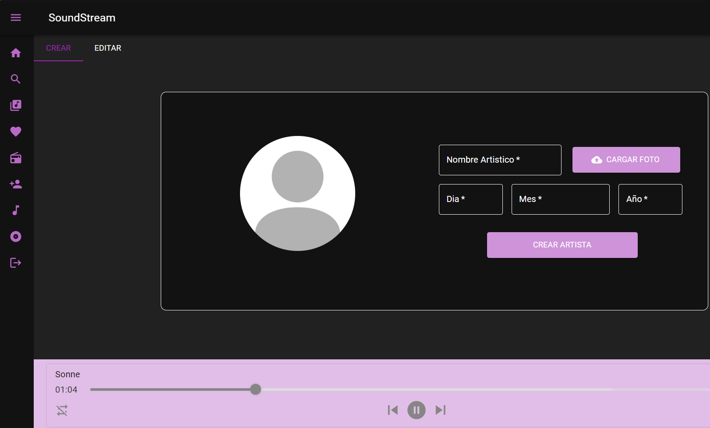
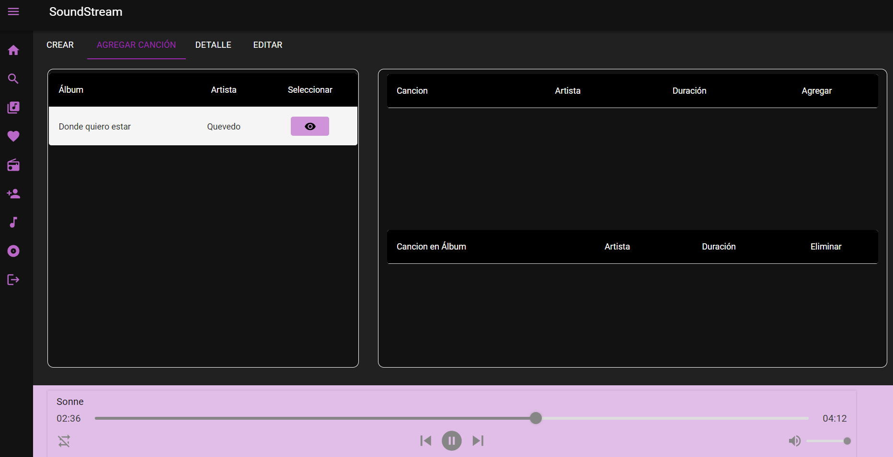
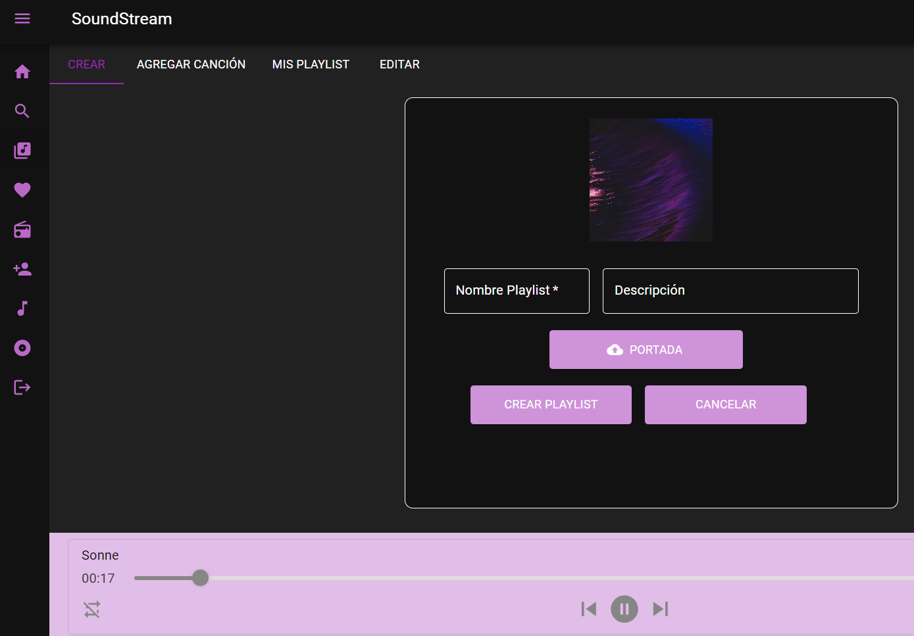
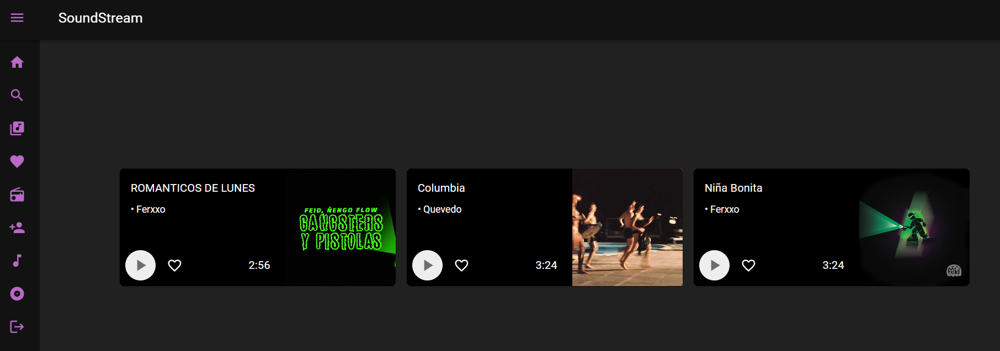
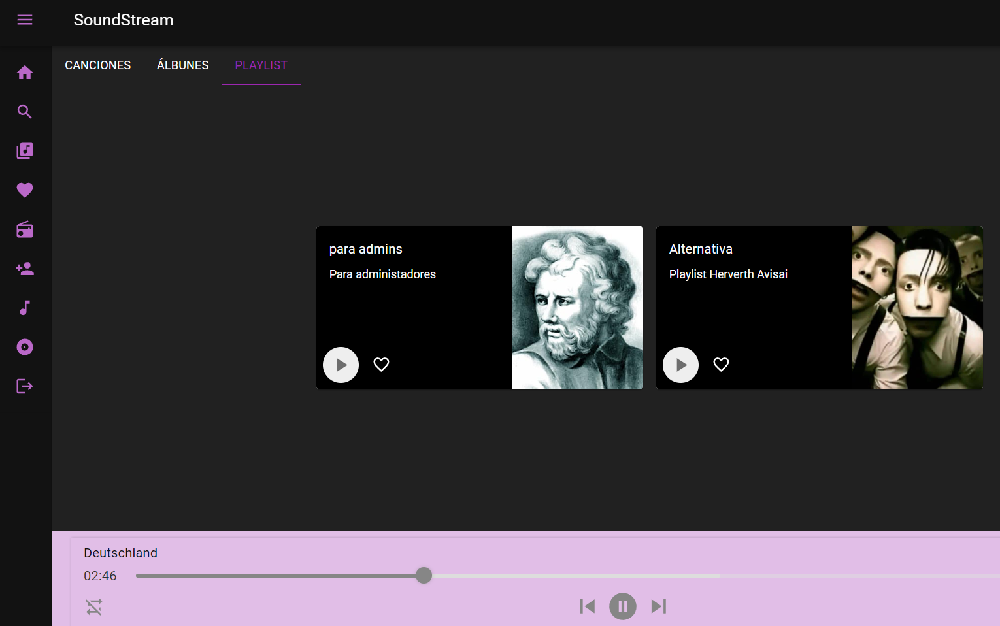

### Universidad de San Carlos de Guatemala, 06 Octubre 2023
### Facultad de Ingeniería
### Escuela de Ciencias y Sistemas
### Seminario de Sistemas 1

---
# Seminario 1 | Grupo #7 | Proyecto 1
---

> Integrantes
> - Deivid Alexander Lux Revolorio - 201549059
> - Fernando José Jr. Serrano Mejia  -   201701039
> - Herberth Abisai Avila Ruiz   -    201504464

---
# MANUAL DE USUARIO
---
## CONTENIDO
* [Descripción](#descripción)
* [Objetivos](#objetivos)
    * [General](#general)
    * [Específicos](#específicos) 
* [Inicio de Sesión](#inicio-de-Sesión)
* [Registro de Usuario](#registro-de-Usuario)
* [Pantalla Principal del Usuario](#principal)
* [Buscar Canciones, Álbumes y Playlists](#canciones-album-playlist)
* [Crear o Modificar una Canción](#crear-Modificar-una-Canción)
* [Explorar y Gestionar Álbumes](#albums)
* [Crear y Editar Playlists](#playlist)
* [Ver Canciones Favoritas](#favoritos)
* [Gestionar Playlists](#gestionar-playlist)
<!-- toc! -->

---

## Descripción
SoundStream es una plataforma de streaming de música cuya intención es promover el arte en el territorio guatemalteco, prometiendo una experiencia robusta, confiable y amigable para sus clientes. Es una plataforma completamente en la nube, diseñada para ser utilizada en cualquier navegador Web. El sistema permite a los clientes escuchar sus canciones favoritas, crear y reproducir playlists personalizadas y escuchar la radio.

---

## Objetivos
### General
* Proporcionar a los usuarios una guía detallada y fácil de entender que les permita utilizar la aplicación de manera eficiente y aprovechar al máximo sus funcionalidades, contribuyendo así a una experiencia del usuario positiva y sin frustraciones
### Específicos
* Proporcionar instrucciones claras y detalladas para las tareas comunes que los usuarios realizarán con frecuencia, como iniciar sesión, buscar canciones y crear playlists. Esto ayudará a los usuarios a realizar estas acciones sin problemas y reducirá la necesidad de asistencia externa.
* Incluir una sección dedicada a la resolución de problemas que cubra los problemas más comunes que los usuarios puedan enfrentar al utilizar la aplicación, junto con soluciones detalladas y claras. El objetivo es permitir que los usuarios resuelvan problemas por sí mismos y minimizar el tiempo de inactividad debido a problemas técnicos.

## Inicio de Sesión
Para comenzar, inicia sesión en tu cuenta utilizando tus credenciales. Ingresa tu nombre de usuario y contraseña en la página de inicio de sesión.

## Registro de Usuario
Si eres un usuario nuevo, puedes registrarte completando el formulario de registro con tu información personal. Asegúrate de ingresar una dirección de correo electrónico válida y una contraseña segura.

## Pantalla Principal del Usuario
Después de iniciar sesión, serás dirigido a tu pantalla principal. Aquí encontrarás una lista de tus canciones y contenido multimedia. Puedes navegar y gestionar tu contenido desde esta página.

## Buscar Canciones, Álbumes y Playlists
Utiliza la barra de búsqueda para encontrar canciones, álbumes o playlists específicas. Ingresa el nombre del artista, canción o álbum que estás buscando y haz clic en "Buscar". Los resultados se mostrarán a continuación.

## Crear o Modificar una Canción
Para crear una nueva canción o modificar una existente, utiliza el componente "Crear/Modificar Canción". Aquí puedes ingresar los detalles de la canción, como el título, artista, álbum y género.

## Crear o Editar un Artista
En el componente "Crear/Editar Artista", puedes añadir información sobre el artista, incluyendo su nombre, biografía y foto. Asegúrate de guardar los cambios después de editar.

## Explorar y Gestionar Álbumes
Utiliza el componente "Explorar Álbumes" para ver una lista de todos los álbumes disponibles. Puedes crear un nuevo álbum, ver detalles y editar la lista de canciones que pertenecen a un álbum.

## Crear y Editar Playlists
En el componente "Crear/Editar Playlist", puedes crear una nueva playlist, agregar canciones a una playlist existente y editar los detalles de la playlist, como su nombre y descripción.

## Ver Canciones Favoritas
Utiliza el componente "Ver Canciones Favoritas" para acceder a la lista de canciones que has marcado como favoritas. Aquí puedes gestionar tus canciones favoritas y quitarlas de la lista si lo deseas.

## Gestionar Playlists
En el componente "Gestionar Playlists", puedes ver todas las playlists que has creado. Puedes editar las playlists existentes, eliminar canciones de una playlist o eliminar toda la playlist si ya no la necesitas.

